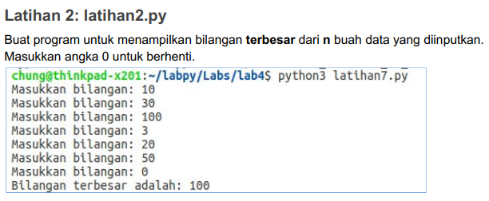
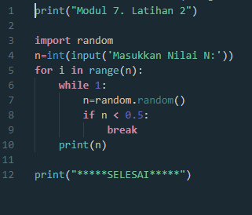

# TUGAS B.PEMOGRAMAN

Nama : M . Aqil Al Farid
Kelas : TI.20.B.1
NIM : 312010140
Dosen : Pak Agung Nugroho, S. Kom,

# 1. Tugas Pratikum 2

Okeee, kita lanjut dengan codingan-nya.

Jika sudah maka tinggal kita jalankan Run/Play. Maka hasilnya akan seperti ini

Dan berikut adalah FLOWCHART dari program menentukan 3 buah bilangan besar.

Selesai.

# 2. Tugas Pratikum 3 | Latihan 1

Di tugas kali ini, kita akan membuat program ALUR ALGORITMA yakni kurang dari 0.5

Dan ini adalah FLOWCHART pada tugas kali ini.

Berikut hasil codingan-nya.

Jika sudah seperti diatas, lalu kita RUN/PLAY. Dan lihat hasilnya.

UNTUK PENJELASAN DI ATAS ADALAH 

print ('Masukkan nilai N: 5')

import random

jumlah = 5

a = 0

for x in range(jumlah):

i = random.uniform(.0,.5)

a+=1

print('data ke:',a,'==>', i)

print ('selesai')

"print" : berfungsi untuk mencetak atau menampilkan objek ke perangkat keluaran (layar) atau ke file teks.

"import" : fungsi lanjut yang dipanggil oleh statement import.

"random" : untuk menentukan suatu pilihan.

"range" : merupakan fungsi yang menghasilkan list. Fungsi ini akan menciptakan sebuah list baru dengan rentang nilai tertentu.

"uniform": digunakan untuk menampilkan bilangan float random dengan batas awal bilangan x, dan batas akhir bilangan y.

# TUGAS Pratikum 2 | Latihan 2

Berikut Soal tugasnya

Dan ini adalah FLOWCHART nya.

Jika sudah memahaminya, kita lanjut dengan codingan-nya.

Jika sudah seperti di atas, lalu kita akan RUN .

Dan apabila sudah keluar hasilnya sesuai diatas, Kita akan lanjut ke Pembahasan pada materi ini.

Berikut adalah penjelasannya.

max=0

while True:

a=int(input('Masukkan bilangan='))

if max < a:

max = a

if a==0:

break

print('Bilangan terbesarnya adalah',max)

"max" : fungsi bulid-in untuk mencari nilai tertinggi. Fungsi ini dapat diberikan sebuah parameter berupa angka.

"while" : disebut uncounted loop (perulangan yang tak terhitung), untuk perulangan yang memiliki syarat dan tidak tentu berapa banyak perulangannya.

"int" : berfungsi mengkonversi bilangan maupun string angka menjadi bilangan bulat (integer).

"if" = Bila suatu kondisi tertentu tercapai maka apa yang harus dilakukan. Dengan fungsi ini kita bisa menjalankan suatu perintah dalam kondisi tertentu.

"input" : masukan yang kita berikan ke program.

"break" : fungsi yang menghentikan operasi dibawahnya jika suatu kondisi yang ditentukan telah tercapai.

"print" : berfungsi untuk mencetak atau menampilkan objek ke perangkat keluaran (layar) atau ke file teks.

Sekian pembahan pada tugas kali ini, Terim Kasih.

# Tugas Pratikum 2 | Latihan 3

Ini adalah FLOWCHART pada tugas kali ini .

Jika sudah paham , kita lanjut dengan codingan.

Dan langsung saja kita RUN.

Berikut Penjelasan pada Tugas kali ini .

masukkan nilai a

gunakan for untuk perulangan dari 1 sampai 8.Perulangan for disebut counted loop (perulangan yang terhitung)

lalu gunakan if pertama untuk menentukan laba bulan ke 1 dan ke 2.masukan variabel (b) kalikan nilai (a) dengan data bulan 1 dan 2. cetak (x) dan (b)

lalu gunakan if kedua untuk menentukan laba bulan ke 3 dan ke 4.masukan variabel (b) kalikan nilai (a) dengan data bulan 3 dan 4. cetak (x) dan (c)

lalu gunakan if ketiga untuk menentukan laba bulan ke 5 sampai ke 7.masukan variabel (b) kalikan nilai (a) dengan data bulan 5 sampai 7. cetak (x) dan (d)

lalu gunakan if keempat untuk menentukan laba bulan ke 8.masukan variabel (b) kalikan nilai (a) dengan data bulan 8. cetak (x) dan (e)

lalu total keseluruhan.

cetak total

Sekian dari saya.

# TUGAS Modul 7 | Latihan 1

Soal.

Tugas kali ini kita akan membuat seperti diatas. Langsung saja ke codingan-nya.

Jika sudah kita lanjut dengan RUN .

# TUGAS Modul 7 | Latihan 2

Soal pada tugas kali ini adalah

Langsung saja kita Coding.

Jika sudah kita cek dengan RUN. Usahakan harus sesuai dengan hasil dari Soal.

